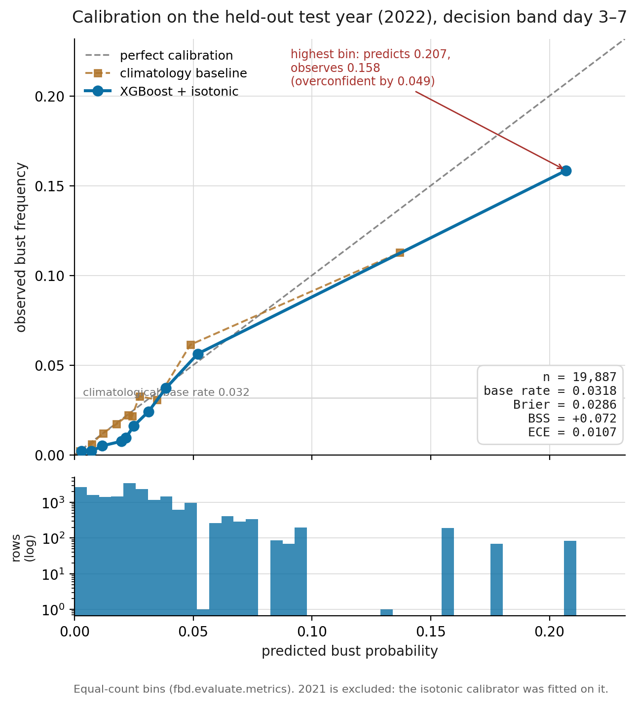
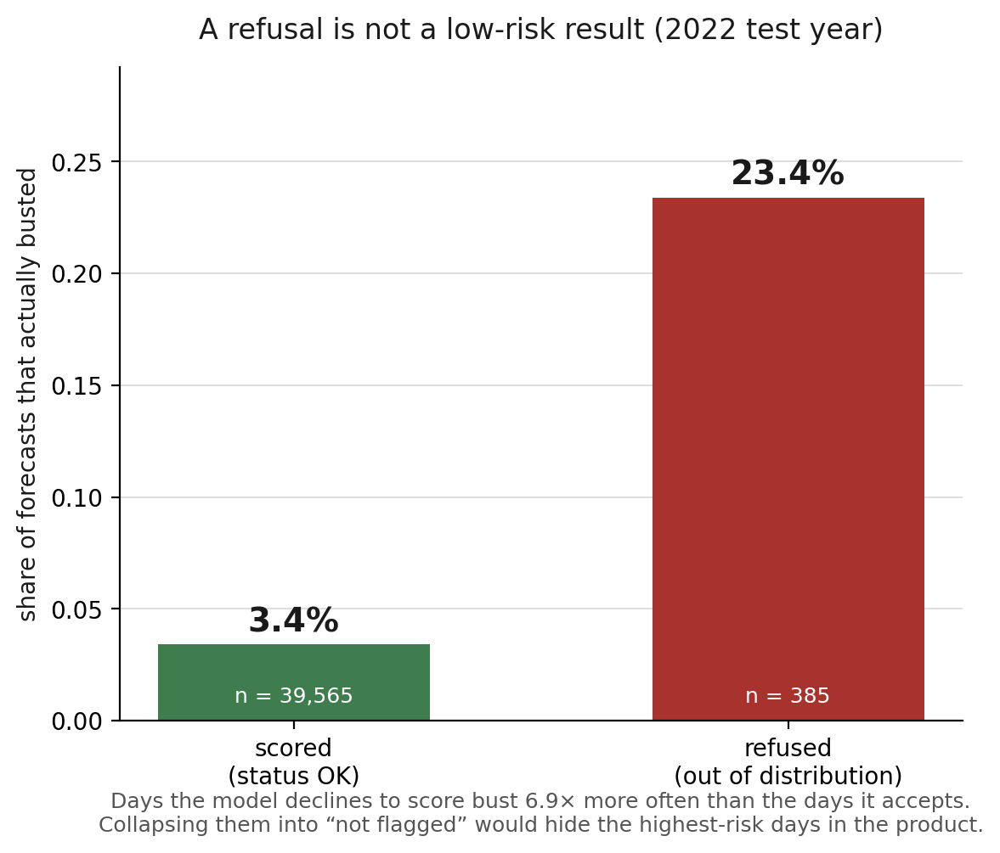
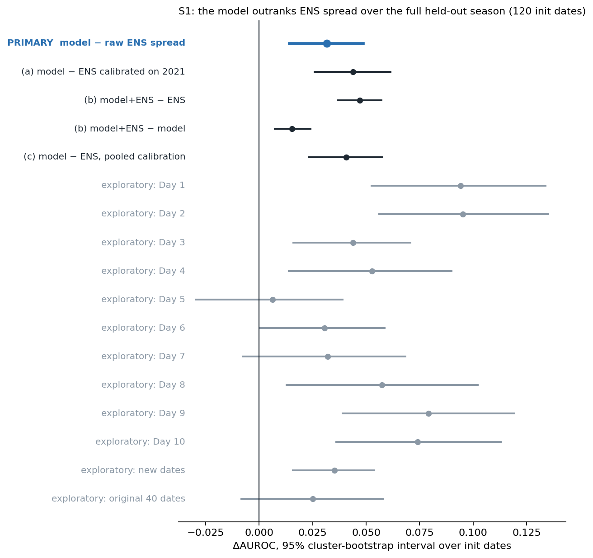
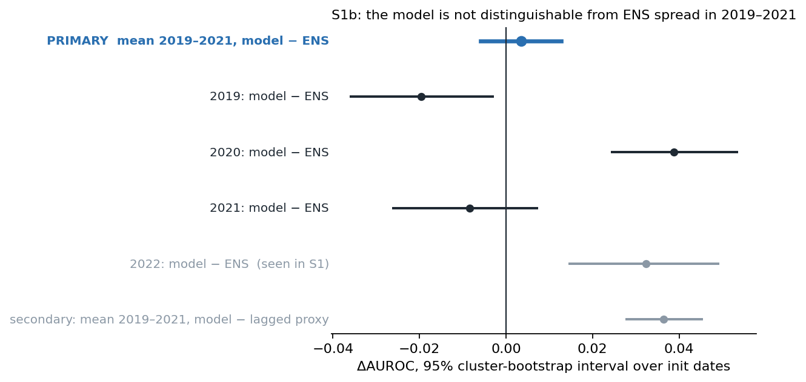
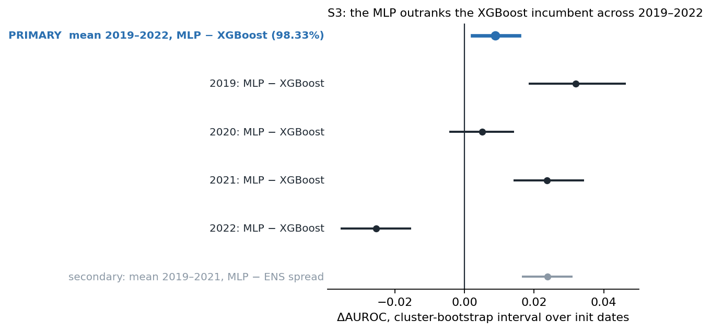

# Evaluation figures

Two claims carry this project, and until now both lived only in prose and a JSON
file: that the model is **calibrated**, and that its refusals are **earned**.
Regenerate both figures with:

```bash
PYTHONPATH=src python scripts/plot_evaluation_figures.py
```

Source: `data/artifacts/bulletins.sqlite` — the same store the dashboard serves,
so these are the product's own outputs, not a separate analysis that could drift
from it.

---

## 1. Calibration — `reliability.png`



A probability is only useful if it means what it says: of the days the model
calls 5%, about 5% should bust. That is the whole claim behind putting a number
in front of a forecaster, and a reliability diagram is the only honest way to
show it.

**Two things this figure is careful about.**

*Test year only.* The store also holds 2021, which is the **validation** split —
`config.VAL_YEARS` — and the isotonic calibrator was *fitted* on it. Plotting a
calibration curve on the data the calibrator was fitted to produces a beautiful
diagonal that means nothing. 2022 is touched only at final evaluation.

*The project's own binning.* Bins and ECE come from `fbd.evaluate.metrics`,
which uses **equal-count** rather than equal-width bins. With a 3.2% base rate,
equal-width bins leave the upper bins nearly empty and produce a dramatic
diagram about almost no data. Using a second definition here would put a number
on the figure that disagreed with the number in `results.json`.

**What it actually shows, including the part that is not flattering.** ECE is
0.0107 and the curve tracks the diagonal closely through the bulk of the range.
But the **highest bin predicts 0.207 and observes 0.158** — overconfident by
0.049, about 24% in relative terms. That bin is exactly where a forecaster is
looking, and it is precisely what a single low ECE hides, which is why the
figure labels it rather than leaving the summary statistic to imply the curve
sits on the diagonal everywhere. The honest statement is *"well calibrated
through the operational range, overconfident in the extreme tail, on ~80 rows."*

The lower panel uses **equal-width** bins, deliberately unlike the panel above:
the markers there each carry the same number of rows by construction, so a
histogram over those bins would be flat and say nothing. It shows how far into
the tail the model is willing to go, and on how little data.

### Cross-check against `results.json`

| | this figure | `results.json`, row `4 XGBoost + isotonic` |
|---|---|---|
| n | 19,887 | 20,060 |
| ECE | 0.0107 | 0.0108 |
| Brier | 0.0286 | 0.0291 |
| BSS | +0.072 | +0.088 |

**The gap is not an error, and it is worth understanding.** `results.json`
scores every test row in the decision band. This figure scores only the rows the
product actually *serves* — and the product refuses 173 of them as out of
distribution, so they carry no probability. 19,887 + 173 = 20,060 exactly.

Those 173 refused rows bust at **17.3%** against 3.2% for the accepted ones.
Removing them lowers the base rate of what remains, which lowers the reference
Brier score that BSS is measured against — so the served subset shows a slightly
lower skill score than the score-everything evaluation. That is the arithmetic
of refusing the hardest rows, not a discrepancy.

---

## 2. Earned refusal — `earned_refusal.png`



The distinction a binary flag destroys. When the Mahalanobis detector puts a
region-day outside the training distribution, the system returns
`OUT_OF_DISTRIBUTION` and no probability. The question a judge should ask is
whether that refusal is a real signal or an excuse.

On the 2022 test year:

| | rows | actually busted |
|---|---|---|
| scored (`status: OK`) | 39,565 | **3.4%** |
| refused (out of distribution) | 385 | **23.4%** |

Days the model declines to score bust **6.9× more often** than the days it
accepts. A refusal is therefore not a low-risk result — it is the opposite, and
collapsing it into "not flagged" would hide the highest-risk days in the
product. This reproduces the 23.4% / 3.4% figure quoted in `LOGIC.md` 11.2
directly from the served store.

This is also why `quality/escalation.py` has three tiers rather than two, and
why the assistant's status-grounding guardrail (D-019 addendum 4) treats "the
system declined to score this" as a claim that must be backed by a tool result:
said about a scored row, it inverts the meaning of the most important cell on
the map.

---

## 3. The ENS settlement — `ens_settlement.png`



Every interval from the registered S1 analysis (D-025) on one axis, with zero
marked. Regenerate with:

```bash
PYTHONPATH=src python scripts/plot_ens_settlement.py
```

Source: `data/artifacts/ens_settlement.json`, written once by
`scripts/settle_ens.py`. The figure only reads it.

Each row is a paired ΔAUROC with a 95% cluster-bootstrap interval over init
dates, the model's AUROC minus the comparator's on the same resampled rows:

| row | what it is | status |
|---|---|---|
| **PRIMARY** (blue, bold) | model − raw IFS ENS spread; 2022, Day 3–7, 120 init dates, 10,000 resamples | **the registered test; the only row the verdict rests on** |
| (a) | model − ENS isotonic-calibrated on 2021 only | secondary |
| (b) model+ENS − ENS | a two-term logistic combination, fitted on 2021, against raw ENS | secondary |
| (b) model+ENS − model | the same combination against the model alone: does ENS add anything? | secondary |
| (c) | model − ENS calibrated on pooled train + val rows, for continuity with D-022 | secondary |
| Day 1 … Day 10 (grey) | the margin at each lead, all 2022 rows with ENS | exploratory, 2,000 resamples |
| new / original 40 dates (grey) | the 80 dates fetched for S1 against the 40-date subsample of D-022 | exploratory, 2,000 resamples |

Secondaries are reported but cannot overturn the primary; grey rows are
exploratory and no claim is drawn from them. The monthly breakdown is in D-025
and the JSON, not on the figure.

**The honest reading.** The primary sits clear of zero: the model outranks the
ensemble's spread over the full held-out season. Row (b) against the model is
also clear of zero, so the ensemble still adds something the model lacks.
Days 5 and 7 and the original 40 dates each straddle zero, which is why a
40-date subsample could not settle the question and 120 dates could.

---

## 4. The backtest — `backtest.png`



Does the 2022 edge over a real ensemble hold in other seasons? One rebuilt
dataset and one retrained model per test year, each fitted only on earlier
years (D-026). Regenerate with:

```bash
PYTHONPATH=src python scripts/plot_backtest.py
```

Source: `data/artifacts/backtest.json`, written once by `scripts/backtest.py`.

| row | what it is | status |
|---|---|---|
| **PRIMARY** (blue, bold) | mean over 2019, 2020, 2021 of model − ENS spread, dates resampled within each year, 10,000 resamples | **the registered test** |
| 2019 / 2020 / 2021 | each year's own margin, 2,000 resamples | registered per-year rule: a year entirely below zero is stated plainly |
| 2022 (muted) | the 2022 fold, retrained through the same machinery | seen in S1, so not in the primary |
| secondary (muted) | mean over 2019–2021 of model − the lagged proxy | secondary |

**The honest reading.** The primary straddles zero: outside 2022 the model is
not distinguishable from the ensemble's spread on average, and 2019 sits
entirely below zero, so there the ensemble wins. The secondary row is the
claim that survives every year: the model beats the cheap proxy.

---

## 5. S3 candidates — `candidate_mlp.png`



One registered candidate against the XGBoost fold models (D-027). Regenerate
with:

```bash
PYTHONPATH=src python scripts/plot_candidate.py --candidate mlp
```

Source: `data/artifacts/candidates/mlp.json`, written once by
`scripts/promote.py --candidate mlp`.

| row | what it is | status |
|---|---|---|
| **PRIMARY** (blue, bold) | mean over 2019–2022 of MLP − XGBoost, dates resampled within each year, 10,000 resamples, 98.33% interval (Bonferroni over three declared candidates) | **the registered test** |
| 2019 … 2022 | each year's own margin, 95% | secondary |
| secondary (muted) | mean over 2019–2021 of MLP − ENS spread, 95%, uncorrected | secondary; cannot promote |

**The honest reading.** The primary clears zero, so the MLP is promoted over
XGBoost on average; but 2022 sits entirely below zero, so in that season
XGBoost is the better model. The muted row is a lead, not a result: it is
uncorrected and was not the question the rule was written for.
